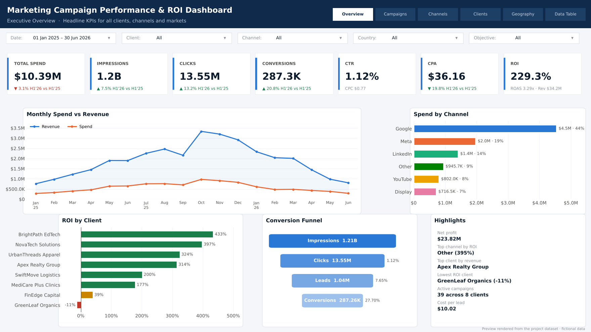
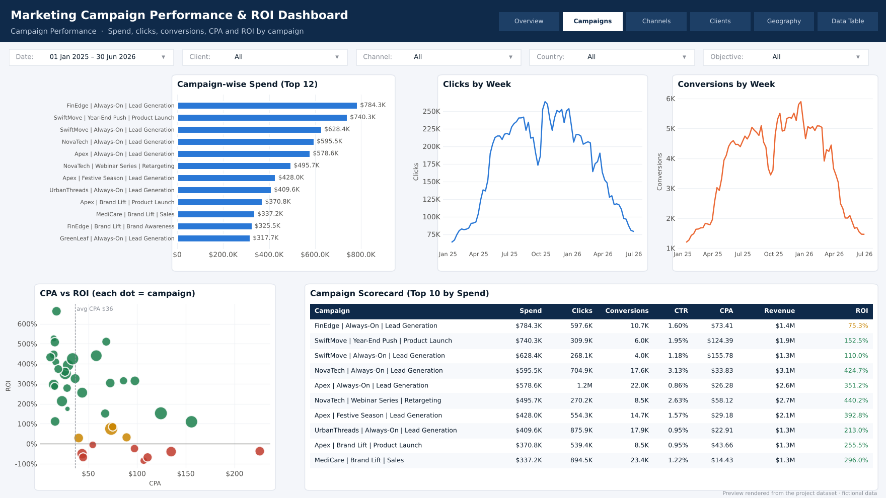
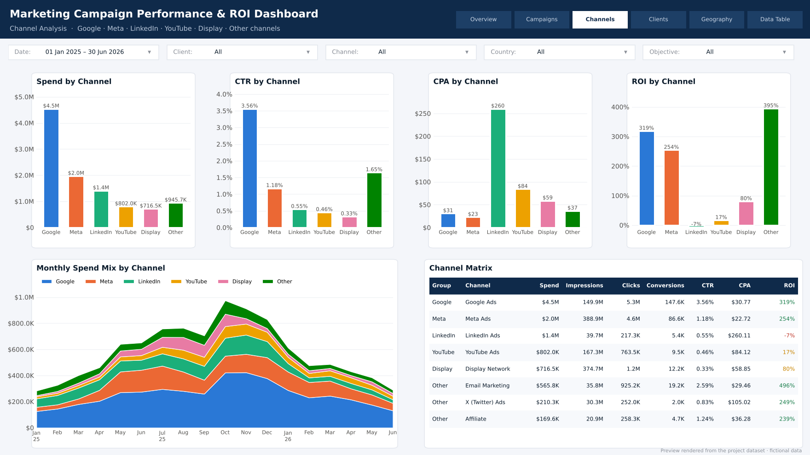
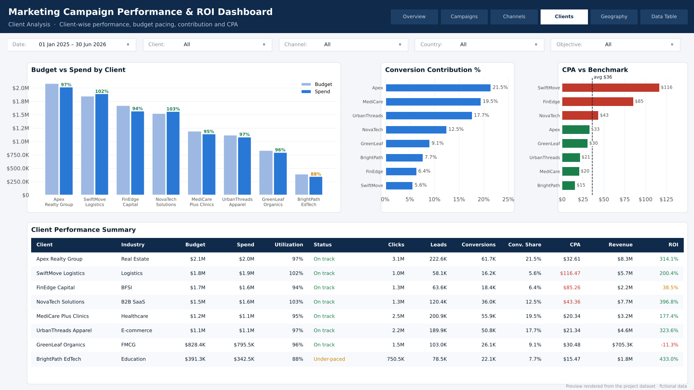
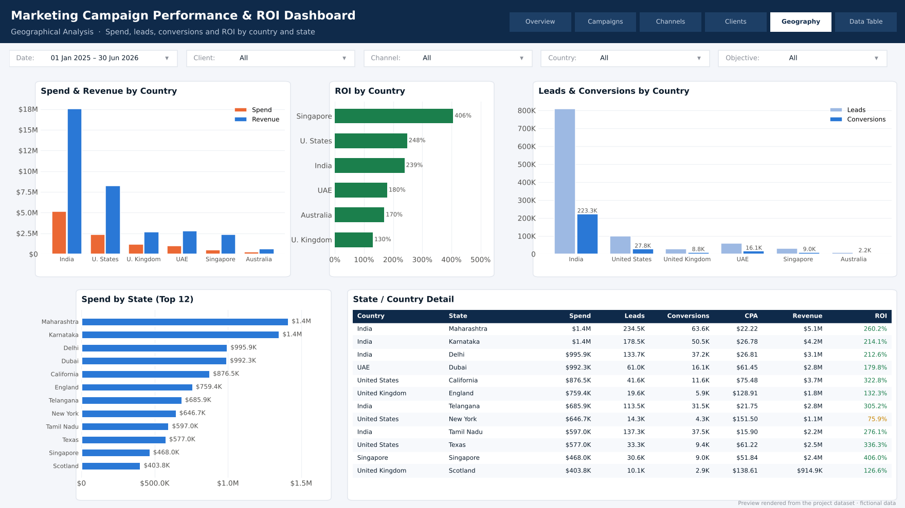
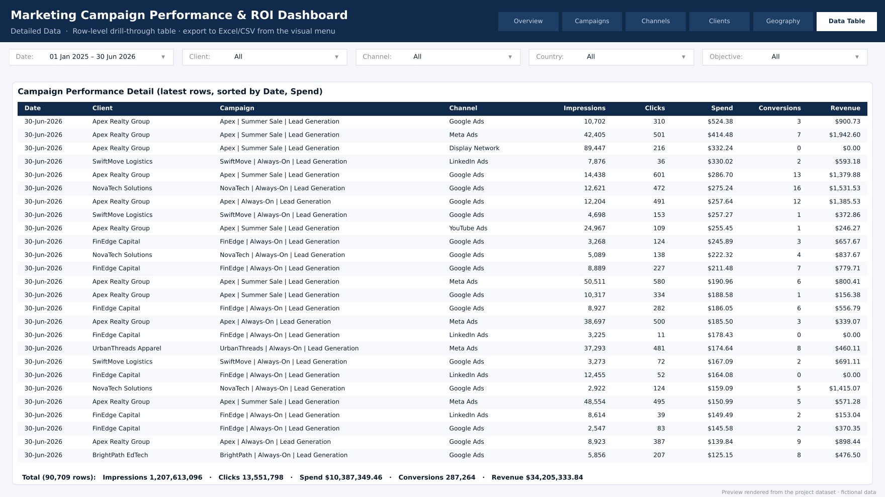

# 📊 Marketing Campaign Performance & ROI Dashboard

An end-to-end **Power BI** project that tracks paid-media performance for a digital marketing agency running campaigns for **8 clients** across **8 channels** and **16 states in 6 countries** — from spend and reach through to conversions, revenue and **ROI**.




---

## 🎯 Business problem

Marketing teams spend across Google, Meta, LinkedIn, YouTube, Display and other partners, but the data sits in separate ad platforms. Leadership needs one place to answer:

- **Are we profitable?** What is the overall ROI / ROAS, and which campaigns lose money?
- **Where should budget move?** Which channels deliver the lowest CPA and highest ROI?
- **Are clients paced correctly?** Is spend on track against budget for each client?
- **Which markets work?** How do states and countries compare on leads, conversions and ROI?

## 📌 Key insights (from the included dataset)

| | Insight |
|---|---|
| 💰 | **$10.39M spend → $34.21M revenue = 229.3% ROI** (ROAS 3.29x), **287K conversions** at **$36.16 CPA** |
| 🔍 | **Google** takes 44% of spend and returns **319% ROI** at a $31 CPA — the efficiency backbone |
| 📉 | **LinkedIn** has the highest CPA (**$260**) and a slightly negative ROI (**-7%**); **YouTube** (17%) and **Display** (80%) work as awareness channels, not converters |
| 🏆 | **BrightPath EdTech** (433%) and **NovaTech Solutions** (397%) are the most profitable clients |
| ⚠️ | **GreenLeaf Organics** runs at **-11% ROI** — low deal value against a normal CPA; needs a pricing or targeting review |
| 🌏 | **India** drives the most conversions at the lowest CPA ($23); **Singapore** has the highest ROI (406%); **UK** is the weakest market (130%) |
| 📅 | Spend peaks in **Oct–Nov** (festive season); H1 2026 converted **20.8% more** than H1 2025 on **3.1% less** spend (CPA ▼ 19.8%) |

> All companies, people and numbers are **fictional** and generated by `scripts/generate_data.py` (seeded, reproducible).

---

## 🗂️ Report pages

| # | Page | What it shows |
|---|------|---------------|
| 1 | **Executive Overview** | Total Spend, Impressions, Clicks, Conversions, CTR, CPA, ROI (with H1 YoY), monthly Spend vs Revenue, spend by channel, ROI by client, conversion funnel, auto-generated highlights |
| 2 | **Campaign Performance** | Campaign-wise spend, clicks & conversions date trend, CPA vs ROI scatter, campaign scorecard with ROI colour coding |
| 3 | **Channel / Partner Analysis** | Google · Meta · LinkedIn · YouTube · Display · Other (Email, X, Affiliate) — spend, CTR, CPA, ROI, monthly spend mix, channel matrix |
| 4 | **Client Analysis** | Client-wise performance, Budget vs Spend (pro-rated), conversion contribution %, CPA vs benchmark, budget status |
| 5 | **Geographical Analysis** | Country & state map/bars — Spend, Leads, Conversions, CPA, ROI |
| 6 | **Detailed Data Table** | Date, Client, Campaign, Channel, Impressions, Clicks, Spend, Conversions, Revenue — drill-through target, exportable |

<details>
<summary><b>📸 See all page previews</b></summary>

### Campaign Performance


### Channel / Partner Analysis


### Client Analysis


### Geographical Analysis


### Detailed Data Table


</details>

> The preview images are rendered from the dataset by `scripts/render_previews.py` to show the layout. After building the report, replace them with your own Power BI screenshots (same file names) so the README shows the real thing.

---

## 🧱 Data model (star schema)

```
                 ┌──────────────┐
                 │   DimDate    │  (DAX calendar, marked as date table)
                 └──────┬───────┘
                        │ 1:*
┌──────────────┐  ┌─────┴──────────────────┐  ┌──────────────┐
│  DimClient   ├──┤   FactPerformance      ├──┤  DimChannel  │
└──────────────┘1:*│ Date · CampaignKey     │*:1└──────────────┘
                   │ ClientKey · ChannelKey │
┌──────────────┐  │ GeoKey · Impressions   │  ┌──────────────┐
│ DimCampaign  ├──┤ Clicks · Spend · Leads ├──┤ DimGeography │
└──────────────┘1:*│ Conversions · Revenue  │*:1└──────────────┘
                   └────────────────────────┘
```

- **Grain:** one row per *Date × Campaign × Channel × State* — 90,709 rows, 1 Jan 2025 – 30 Jun 2026
- All relationships are **one-to-many, single direction** from dimension to fact
- `DimCampaign` carries the **Budget**, which is **pro-rated by date** in DAX so *Budget vs Spend* stays correct under any date filter
- Full column list: [`docs/data_dictionary.md`](docs/data_dictionary.md)

## 🧮 Key DAX measures

```DAX
CTR  = DIVIDE ( [Total Clicks], [Total Impressions] )
CPA  = DIVIDE ( [Total Spend], [Total Conversions] )
ROI  = DIVIDE ( [Total Revenue] - [Total Spend], [Total Spend] )
ROAS = DIVIDE ( [Total Revenue], [Total Spend] )

Conversion Contribution % =
DIVIDE ( [Total Conversions], CALCULATE ( [Total Conversions], ALLSELECTED ( FactPerformance ) ) )
```

40+ measures — base totals, efficiency KPIs (CTR, CPC, CPM, CPL, CPA, ROI, ROAS), pro-rated budget & utilisation, share/contribution, time intelligence (MoM, YoY, YTD, 7-day rolling CPA), rankings and conditional-formatting colours — are in [`powerbi/dax/measures.dax`](powerbi/dax/measures.dax).

| KPI | Formula | Read it as |
|---|---|---|
| CTR | Clicks ÷ Impressions | How engaging the ad is |
| CPC | Spend ÷ Clicks | Cost of one visit |
| CPL | Spend ÷ Leads | Cost of one enquiry |
| CPA | Spend ÷ Conversions | Cost of one customer — lower is better |
| ROI | (Revenue − Spend) ÷ Spend | Profit per $1 spent — above 0% is profitable |
| ROAS | Revenue ÷ Spend | Revenue per $1 spent |

---

## 📁 Repository structure

```
Marketing-Campaign-Performance-ROI-Dashboard/
├── README.md
├── data/
│   ├── model/                         # star schema loaded by Power BI
│   │   ├── fact_campaign_performance.csv
│   │   ├── dim_campaign.csv
│   │   ├── dim_channel.csv
│   │   ├── dim_client.csv
│   │   └── dim_geography.csv
│   └── raw/
│       └── marketing_campaign_performance_flat.csv   # one denormalised table (Excel-friendly)
├── powerbi/
│   ├── Marketing_Campaign_ROI_Dashboard.pbix         # ← add after you build it
│   ├── dax/measures.dax
│   ├── power-query/*.m                               # M script per table + parameter
│   └── theme/marketing_roi_theme.json
├── scripts/
│   ├── generate_data.py                              # rebuilds the dataset
│   └── render_previews.py                            # rebuilds the README images
├── docs/
│   ├── report_build_guide.md                         # step-by-step, page by page
│   ├── data_dictionary.md
│   └── images/
├── requirements.txt
└── LICENSE
```

## 🚀 How to use

1. **Clone** the repo
   ```bash
   git clone https://github.com/<your-username>/Marketing-Campaign-Performance-ROI-Dashboard.git
   ```
2. **Open the report** — double-click `powerbi/Marketing_Campaign_ROI_Dashboard.pbix` in Power BI Desktop, then *Transform data → Edit parameters* and point `DataFolderPath` at your local `data/model/` folder → **Refresh**.
3. **Or build it yourself** — follow [`docs/report_build_guide.md`](docs/report_build_guide.md) (≈ 2–3 hours).
4. **Regenerate data** (optional)
   ```bash
   pip install -r requirements.txt
   python scripts/generate_data.py
   python scripts/render_previews.py
   ```

## 🛠️ Tools & skills demonstrated

- **Power Query (M):** parameterised CSV ingestion, data typing, calculated columns
- **Data modelling:** star schema, surrogate keys, date table, single-direction relationships
- **DAX:** `CALCULATE`, `ALLSELECTED`, `SUMX` iterators, time intelligence, `RANKX`, `TOPN`, dynamic labels, pro-rated budget logic
- **Report design:** custom JSON theme, KPI cards with YoY indicators, conditional formatting, drill-through, synced slicers, page navigation buttons, tooltips
- **Python:** pandas/NumPy synthetic data generation with realistic funnels, seasonality and pacing

## 🔭 Possible extensions

- Connect live sources (Google Ads, Meta Marketing API, LinkedIn) via connectors or a warehouse
- Add a monthly budget table for month-level pacing alerts
- Multi-touch attribution model and what-if parameter for budget reallocation
- Publish to Power BI Service with scheduled refresh and row-level security per client / account manager

---

**Author:** Jeevi · [GitHub](https://github.com/<jeevi0>) · [LinkedIn](https://www.linkedin.com/in/jeevi0410/>)

⭐ If you found this useful, consider giving the repo a star!
